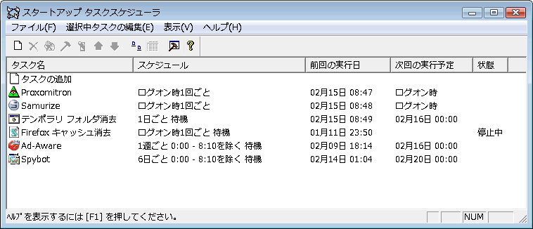
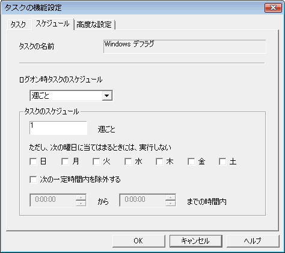
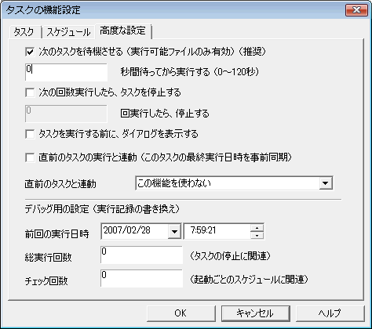

スタートアップ タスクスケジューラ 
Startup Task Scheduler for Windows

---
[Home](https://oasis3855.github.io/webpage/) > [Software](https://oasis3855.github.io/webpage/software/index.html) > [Software Download](https://oasis3855.github.io/webpage/software/software-download.html) > ***win-stask*** (this page)

 
 

Last Updated : Feb. 2012 -- ***this is discontinued software 開発終了***

- [ソフトウエアのダウンロード](#ソフトウエアのダウンロード)
- [概要](#概要)
  - [機能の概略](#機能の概略)
- [制限事項](#制限事項)
- [動作環境](#動作環境)
- [バージョンアップ情報](#バージョンアップ情報)
- [主な掲載雑誌](#主な掲載雑誌)
- [ライセンス](#ライセンス)

 
 

## ソフトウエアのダウンロード

-    [このGitHubリポジトリを参照する（ソースコード）](source_code/) 

-    [このGitHubリポジトリのreleaseディレクトリを参照する（ソースコード, 実行ファイル）](release/) 

-    [Googleドライブを参照する（ソースコード, 実行ファイル）](https://drive.google.com/drive/folders/0B7BSijZJ2TAHYzVmMjUxYTItNmI2NS00NmFkLWI4MWYtZTE2ODUxYTY0Zjk3) 

-    [Vector ソフトウエア ライブラリを参照する（実行ファイル）](http://www.vector.co.jp/soft/dl/win95/util/se105685.html) 

-    [Google Codeを参照する（ソースコード, 実行ファイル）](https://code.google.com/archive/p/startup-task-scheduler/downloads) ※閉鎖

## 概要

このソフトウエアは、「起動時に毎回実行する必要はないが、1週間に1回は実行しておきたい。但し12:00から13:00は除く」というような、様々な条件をつけてプログラムを実行するためのスケジューラ ソフトウエアです。

常時起動のサーバを主な対象としたWindowsビルトインのタスクスケジューラと、実行条件が付けられないWindowsのスタートアップ フォルダでは実現できない機能を中心に作られています。 

### 機能の概略

- Windows 2000/XPのタスクスケジューラと似た画面で、使い勝手の統一性を実現
- 登録されたタスクの処理が完了すれば終了し、常駐しない
- 実行ファイル、スクリプトをタスクとして登録可
- タスクの起動条件に任意の日・週・月単位、ログイン回数、電源条件等を指定可
- タスクの不起動条件に特定曜日、時間帯等を指定可
- パスワードによる設定画面の簡易ロック機能 

メイン ウインドウ（タスク一覧表示画面） 

タスク実行条件設定画面の例 

タスク実行条件設定画面の例 

## 制限事項 

- タスク実行回数、実行チェック回数は1万回までのカウントアップとなっています。1万回目で0にリセットされます。
- Windows 7でヘルプファイルが表示できない場合、ファイル エクスプローラでヘルプファイルを右クリックしてファイルのプロパティ画面を開き、セキュリティの「制限を解除する」ボタンを押すことで表示できるようになります。 

## 動作環境

- Windows 95/98/Me/NT4/2000/XP/Vista/7 

##  バージョンアップ情報

- Version 1.1 (1999/07/15)

  - [BugFix] アンインストール時にアイコンが消去されない問題を解決 
  - [BugFix] パスワードがわからなくてもセキュリティー設定ができる問題を解決 

- Version 1.2 (1999/07/31)

  - [BugFix] Windows95で起動時にシステム停止する問題を解決（MRU管理復活） 

- Version 1.5 (1999/11/27)

  - [BugFix] Windows95で２回目以降の起動時にシステム停止する問題を解決。また、GDIエラーについても解決（イメージリスト・ハンドラとアイコン・ハンドラの開放方法のミスを訂正） 
  - [BugFix] 12月と1月をまたぐnヶ月単位の計算のミスを訂正 
  - [BugFix] マルチユーザーに対応。（レジストリ削除方法をHKEY_USERSからHKEY_CURRENT_USERへ変更） 
  - 英語メッセージ版を付属 (sTask_e.exe) 

- Version 1.6 (2002/05/15)

  - [VerUp] Windows 2000/XP 対応（アンインストーラを対応） 
  - [VerUp] 実行状況のダイアログを別スレッドに 
  - [BugFix] 問い合わせダイアログを最前面に 
  - [VerUp] 英語リソースの結合で、日本語版以外のWindowsで動作が可能 

- Version 1.61 (2002/11/14)

  - [BugFix] 間にスペースの入るパスを実行できない問題を修正 (spawn → CreateProcess) 
  - [VerUp] 拡張子 CMD も後のタスクを待機させられる 

- Version 1.62 (2003/07/15)

  - [BugFix] タスクの追加で最終ステップでの設定が反映されないバグを修正 
  - [VerUp] 直前のタスクと連動機能を拡充 

- Version 1.63 (2003/08/14)

  - [VerUp] カレントディレクトリ設定の追加 
  - [VerUp] 作業フォルダ設定の追加 
  - [VerUp] ウインドウ状態の追加 
  - [VerUp] 多重起動の防止 

- Version 1.65beta (2004/02/08)

  - [VerUp] 電源状態の追加 

- Version 1.66 (2007/01/27)

  - [VerUp] HTML help 化 
  - [VerUp] （実質的に無意味だった）お気に入りタスクの削除 
  - [VerUp] アイコンの追加（JScript, VBScript, shell script, other） 
  - [VerUp] パスワードの乱数が初期化されていなかったバグを修正（srand 関数の追加） 
  - [VerUp] ツールバーをフラット・ツールバーに変更 
  - [VerUp] Windows Vista 対応 

- Version 1.7 (2012/02/27)

  - パスワード保存をSHA-1ハッシュに変更 

## 主な掲載雑誌 

-  DOS/V Magazine (ソフトバンク) 
-  DOS/V Power Report (インプレス) 
-  DOS/V USER (宝島社) 
-  I/O (工学社) 
-  テックウィン (アスキー) 
-  Windows 100% (晋遊舎) 
-  PC Japan (ソフトバンク) 
-  得するインターネット（コアマガジン） 
-  ウインドウズ・パワー（アスキー） 
-  インターネットスタート・ウインドウズＲｏｍ！（毎日コミュニケーションズ） 
-  フリーウェアバンク3000 （アスキー） 
-  窓の杜 Review News / LYCOS ニュース / goo ニュース 

## ライセンス

このスクリプトは [GNU General Public License v3ライセンスで公開する](https://gpl.mhatta.org/gpl.ja.html) フリーソフトウエア
